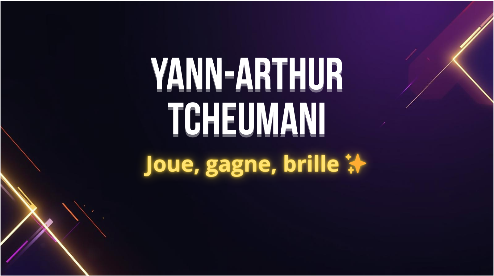

  

# 👋 Salut, moi c’est Yann-Arthur Tcheumani  

Bienvenue sur mon GitHub !  
Je suis un développeur **polyvalent** passionné par la **création de projets innovants** et la **résolution de problèmes concrets**. J’explore différents domaines du développement (web, cloud, IA, robotique) tout en avançant sur mes projets personnels et professionnels.  

---

## 🚀 À propos de moi  
- 🎓 Étudiant à **EPITECH**  
- 💻 Développeur passionné par le **web**, le **cloud (AWS)**, la **Data Science** et **Iot**
- 🕹️ Fondateur de **[YPLAY](https://yplay.fr)**, une plateforme de jeux compétitifs où l’on peut jouer, gagner et briller ✨ 
- 📊 Expérience en **data analyse**, **backend (FastAPI, Python, Node.js)**, et **frontend (React, Next.js, Vite, TailwindCSS)**  
- ☁️ Exploration du **serverless (AWS Lambda, Cognito, DynamoDB, Amplify)**  
<!-- - 🔗 Intérêt pour la **blockchain** et l’intégration de cryptomonnaies dans des projets réels   -->

---

## 🛠️ Tech Stack  

### Langages & Frameworks  
     
 
   

     

### Bases de données & Cloud  
      

<!--   
   -->

### Outils  
  
<!--    -->

---

## 🌍 Projets clés  
- 🎮 **YPLAY** → Plateforme de jeux compétitifs avec système de monnaie virtuelle (YCoins), classement et abonnements freemium/premium

<!-- - 📊 **welcooom_data** → Projet de data analyse et dashboarding pour LesCityzens  
- ☁️ Migration & déploiement de solutions sur **AWS** et **O2Switch**   -->

## 📊 Mes Stats GitHub  

    
  

---

## 📫 Me contacter  
- 💼 LinkedIn : [https://www.linkedin.com/in/yann-arthur-tcheumani-mbialeu/](www.linkedin.com/in/yann-arthur-tcheumani-mbialeu)  
- 🌐 Portfolio (bientôt en ligne)  
- ✉️ Email : tcheumaniyannarthur@gmail.com

---

## ✨ Fun fact  
Quand je ne code pas, je pense souvent à de nouvelles idées d’applications pour rendre le quotidien plus ludique et productif 🚀  
